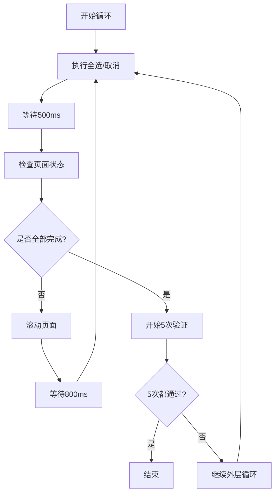

# Maximo 安全组批量授权助手 - 使用指南

## 📋 插件简介

这是一个专为 **Maximo 9.1** 系统设计的 Chrome 浏览器插件，主要用于在**安全组批量授权**场景中快速勾选/取消勾选大量复选框。

### 适用场景
- ✅ Maximo 安全组（Security Groups）批量授权
- ✅ 需要勾选大量权限复选框的场景
- ✅ 支持动态加载的长列表页面
- ✅ 任何使用 `cds--checkbox` 组件的页面

---

## 🚀 快速开始

### 1. 安装插件

#### 方法一：开发者模式安装（推荐）
1. 打开 Chrome 浏览器
2. 访问 `chrome://extensions/`
3. 开启右上角的 **"开发者模式"**
4. 点击 **"加载已解压的扩展程序"**
5. 选择插件所在目录（包含 `manifest.json` 的文件夹）
6. 插件安装成功！

#### 方法二：打包安装
1. 在 `chrome://extensions/` 页面点击 **"打包扩展程序"**
2. 选择插件根目录
3. 生成 `.crx` 文件后拖拽到扩展页面安装

### 2. 验证安装
- 在 Chrome 工具栏找到插件图标
- 点击图标，应该能看到操作界面

---

## 💡 核心功能

### 功能概览

| 功能 | 说明 |
|------|------|
| 🔘 全选 | 勾选当前页面所有复选框 |
| ⭕ 取消全选 | 取消当前页面所有复选框的勾选 |
| 🔄 反选 | 反转所有复选框的勾选状态 |
| ♻️ 循环操作 | 自动滚动并处理所有复选框（最多20次） |
| 📊 实时统计 | 显示复选框总数和已勾选数量 |

---

## 🎯 使用场景详解

### 场景一：Maximo 安全组批量授权

#### 问题背景
在 Maximo 系统中，为安全组授权时，可能需要勾选数百个权限项。手动逐个勾选效率极低，且容易遗漏。

#### 解决方案
使用本插件的**循环全选**功能，自动处理所有权限复选框。

#### 操作步骤

1. **进入安全组授权页面**
   ```
   系统管理 → 安全组 → 选择安全组 → 应用程序选项卡 → 授权
   ```

2. **打开插件**
   - 点击 Chrome 工具栏上的插件图标

3. **启用循环操作**
   - ✅ 勾选 "循环操作（最多20次，无变化时自动检查5次）"
   - 这个选项会持久保存，下次打开插件仍然有效

4. **执行全选**
   - 点击 **"全选"** 按钮
   - 插件会自动：
     - 勾选当前可见的所有复选框
     - 检查是否还有未勾选的
     - 如果有，自动滚动页面加载更多
     - 重复上述过程，直到所有复选框都被勾选
     - 最后进行5次验证确认

5. **查看结果**
   - 打开浏览器的"审查弹出内容"控制台
   - 查看详细的执行日志

#### 预期效果
```
[POPUP] 🔄 开始循环全选，最大循环次数: 20

[POPUP] === 第 1 次循环 ===
[POPUP] 📊 检查结果: 总数=50, 已勾选=50, 未勾选=0
[POPUP] ✅ 检测到所有复选框已勾选，开始验证确认...

[POPUP] 🔍 === 第 1 次验证检查 ===
[POPUP] ⏱️ 等待1秒后进行第 1 次验证...
[POPUP] 📊 第 1 次验证结果: 总数=50, 已勾选=50, 未勾选=0
[POPUP] ✅ 第 1 次验证通过：仍然全部勾选

... (重复5次验证)

[POPUP] ✅ 验证完成：连续5次确认全部勾选
[POPUP] 📊 最终结果: 共循环 1 次，已勾选 50/50 个复选框
```

---

### 场景二：普通页面的批量操作

如果页面不需要滚动加载（所有复选框都在一页），可以：

1. **不勾选"循环操作"**
2. 直接点击 **"全选"** 或 **"取消全选"**
3. 一次性完成操作

---

## 🔧 高级功能说明

### 循环操作机制

#### 工作流程


#### 智能验证
- **检测时机**：只有当检测到"已完成"时才进行验证
- **验证次数**：最多5次，每次间隔1秒
- **验证逻辑**：
  - 如果5次都确认完成 → 结束循环
  - 如果发现还有未处理的 → 继续循环处理

#### 性能优化
- 发现未完成时立即继续，不浪费时间验证
- 只在确认完成时才进行多次验证
- 自动滚动加载更多内容

---

### 持久化保存

插件会自动保存您的设置：
- ✅ "循环操作"复选框的状态会被保存
- 下次打开插件时自动恢复上次的设置
- 数据存储在 `chrome.storage.local` 中

---

## 📊 日志查看

### 如何查看日志

由于 Chrome 插件的特殊性，日志分为两部分：

#### 1. Popup 日志（插件界面日志）
**查看方法：**
1. 右键点击插件图标
2. 选择 **"审查弹出内容"**
3. 在打开的 DevTools 控制台中查看

**日志示例：**
```
[POPUP] 🔄 开始循环全选，最大循环次数: 20
[POPUP] === 第 1 次循环 ===
[POPUP] 📊 检查结果: 总数=100, 已勾选=85, 未勾选=15
[POPUP] ⚠️ 发现 15 个未勾选的复选框，继续循环...
[POPUP] 📜 滚动页面加载更多...
```

#### 2. Content Script 日志（页面操作日志）
**查看方法：**
1. 按 `F12` 打开页面开发者工具
2. 切换到 **Console** 标签

**日志示例：**
```
[Checkbox Helper] 开始操作复选框
[Checkbox Helper] 找到复选框数量: 22
[Checkbox Helper] ✓ 第 1 个复选框操作成功
[Checkbox Helper] ========== 操作完成 ==========
[Checkbox Helper] 总计: 22, 成功: 22, 跳过: 0, 错误: 0
```

---

## ❓ 常见问题

### Q1: 为什么有些复选框没有被勾选？

**可能原因：**
1. 没有启用"循环操作"功能
2. 页面还在加载中
3. 复选框不在可视区域内

**解决方案：**
- ✅ 确保勾选了"循环操作"
- 等待页面完全加载
- 查看日志确认执行情况

---

### Q2: 循环操作会一直运行吗？

**不会！** 有以下保护机制：
- 最大循环次数：20次
- 验证机制：连续5次确认完成才结束
- 如果5次验证后发现还有未处理的，会继续循环

---

### Q3: 如何知道插件是否在工作？

**观察以下迹象：**
1. 页面自动滚动
2. 复选框被逐个勾选
3. 控制台有日志输出
4. 插件界面上的统计数据在更新

---

### Q4: 可以在其他网站使用吗？

**可以！** 虽然主要针对 Maximo 开发，但插件适用于：
- 任何使用 `cds--checkbox` 组件的网站
- 任何有大量复选框需要批量操作的场景

---

### Q5: 插件安全吗？

**完全安全！**
- ✅ 开源代码，可审查
- ✅ 只操作当前页面的 DOM
- ✅ 不收集任何用户数据
- ✅ 不使用网络请求
- ✅ 权限最小化（仅需要 activeTab、scripting、storage）

---

## 🛠️ 技术细节

### 事件触发策略

为了确保 React 等框架能正确捕获复选框状态变化，插件采用了多重事件触发：

1. **原生 setter**：绕过框架拦截直接设置值
2. **Label 点击**：点击 label 元素触发 React 事件
3. **Input 事件**：触发 input 事件
4. **Change 事件**：触发 change 事件
5. **Click 事件**：模拟真实点击
6. **Mouse 事件**：触发 mousedown/mouseup

这种策略确保了在各种框架下都能正常工作。

---

### 选择器说明

默认选择器：`input.cds--checkbox`

这是 Carbon Design System 的复选框组件类名，Maximo 9.1 广泛使用此组件库。

---

## 📝 版本历史

详见 [CHANGELOG.md](./CHANGELOG.md)

---

## 🐛 故障排除

如果遇到任何问题，请查看：
- [TROUBLESHOOTING.md](./TROUBLESHOOTING.md) - 详细故障排除指南
- [TESTING.md](./TESTING.md) - 测试方法和用例

---

## 📞 支持与反馈

如有问题或建议，欢迎反馈！

---

## 📄 许可证

本项目采用 MIT 许可证。

---

**祝您使用愉快！** 🎉
