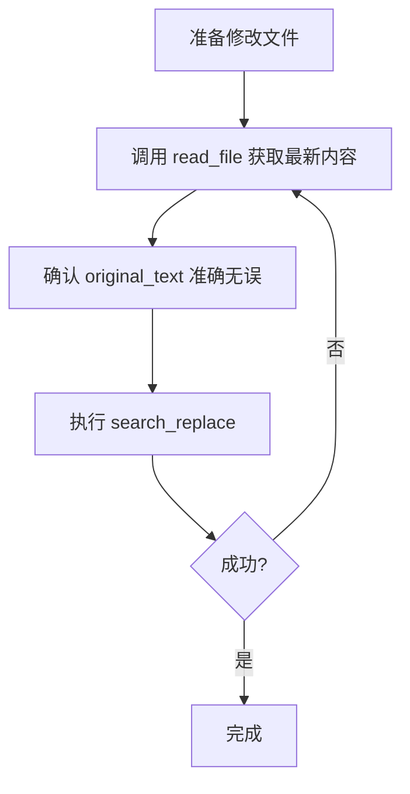

# Maximo Vue 组件开发指南

## 📋 项目概述

本项目是一个基于 **Vue 3 + Vite** 的 Maximo UI 风格组件库，旨在为 IBM Maximo 系统提供现代化的前端界面解决方案。所有组件严格遵循 Maximo 的设计规范和视觉风格。

---

## 🎨 设计风格与规范

### 1. 颜色体系

```css
/* 主色调 */
--primary-blue: #0F62FE;        /* Maximo 蓝色 */
--primary-hover: #0353E9;       /* 悬停状态 */

/* 背景色 */
--bg-gray: #f1f1f1;             /* 页面背景 */
--bg-white: #ffffff;            /* 卡片背景 */
--bg-light: #FAFAFA;            /* 浅色区域 */

/* 边框色 */
--border-light: #E0E0E0;        /* 浅边框 */
--border-medium: #c6c6c6;       /* 中等边框 */
--border-dark: #8D8D8D;         /* 深色边框/输入框底部 */

/* 文字色 */
--text-primary: #161616;        /* 主要文字 */
--text-secondary: #464646;      /* 次要文字/标签 */
--text-disabled: #666666;       /* 禁用文字 */

/* 状态色 */
--error-red: #DA1E28;           /* 错误/必填标记 */
```

### 2. 字体规范

- **字体系列**: `IBM Plex Sans` (MaximoBase), "Segoe UI", "Microsoft YaHei", Arial, sans-serif
- **标题字号**: 
  - 页面标题: 28px (加粗)
  - Section 标题: 16px (加粗)
  - 表格表头: 13px (加粗)
- **正文字号**: 13px - 14px
- **行高**: 1.5 - 1.8

### 3. 间距规范

- **Section 内边距**: 16px - 24px
- **表单字段间距**: 8px - 12px
- **表格单元格内边距**: 10px 12px
- **按钮内边距**: 8px 24px

### 4. 圆角规范

- **输入框/按钮**: 0px (直角，Maximo 特色)
- **卡片/容器**: 4px (轻微圆角)

---

## 🧩 核心组件使用规范

### 1. 表单组件

#### MaximoTextbox（单行文本框）

```vue
<MaximoTextbox 
  v-model="formData.fieldName" 
  label="字段标签" 
  :required="true"
  :readonly="false"
  width="200px"
/>
```

**关键特性**:
- ✅ 标签内置在组件中（不要放在 MaximoSectionCol 的 label 属性）
- ✅ 支持 `required` 和 `readonly` 状态
- ✅ 宽度通过 `width` 属性控制
- ✅ 只读状态背景色为 `#F4F4F4`
- ✅ 支持 `placeholder` 属性用于查询输入框

**查询输入框示例**:
```vue
<MaximoTextbox
  v-model="queryParams.queryYear"
  label="请输入查询月份：年"
  width="80px"
  placeholder="2026"
/>
```

#### MaximoMultilineTextbox（多行文本框）

```vue
<MaximoMultilineTextbox 
  v-model="formData.remark" 
  label="备注" 
  :rows="4"
  wrapperWidth="100%"
  textareaWidth="500px"
/>
```

**注意**: 
- `wrapperWidth` 控制外层容器宽度
- `textareaWidth` 控制文本域实际宽度

### 2. 布局组件

#### MaximoSection（区块容器）

```vue
<MaximoSection title="区块标题">
  <!-- 内容 -->
</MaximoSection>
```

**样式特点**:
- 有标题时：显示灰色背景 `#f1f1f1`
- 无标题时：白色背景，仅保留边框

#### MaximoSectionRow & MaximoSectionCol（行列布局）

```vue
<MaximoSectionRow>
  <MaximoSectionCol>
    <MaximoTextbox v-model="data.field1" label="字段1" width="200px" />
  </MaximoSectionCol>
  <MaximoSectionCol>
    <MaximoTextbox v-model="data.field2" label="字段2" width="200px" />
  </MaximoSectionCol>
  <MaximoSectionCol colspan="2">
    <MaximoTextbox v-model="data.field3" label="跨列字段" width="400px" />
  </MaximoSectionCol>
</MaximoSectionRow>
```

**三列布局规范**（推荐）:
```vue
<MaximoSectionRow>
  <!-- 第一列：核心业务信息 -->
  <MaximoSectionCol>
    <MaximoTextbox v-model="data.field1" label="字段1" width="200px" />
    <MaximoTextbox v-model="data.field2" label="字段2" width="200px" />
  </MaximoSectionCol>
  
  <!-- 第二列：分类与属性 -->
  <MaximoSectionCol>
    <MaximoTextbox v-model="data.field3" label="字段3" width="200px" />
    <MaximoTextbox v-model="data.field4" label="字段4" width="200px" />
  </MaximoSectionCol>
  
  <!-- 第三列：人员与状态 -->
  <MaximoSectionCol>
    <MaximoTextbox v-model="data.field5" label="字段5" width="200px" />
    <MaximoTextbox v-model="data.field6" label="字段6" width="200px" />
  </MaximoSectionCol>
</MaximoSectionRow>
```

**关键点**:
- ❌ **不要在 MaximoSectionCol 上设置固定 width**，让它自适应
- ✅ 在 MaximoTextbox 上设置 `width` 控制输入框宽度
- ✅ 使用 `colspan` 实现跨列布局
- ✅ 同一列内垂直堆叠多个字段，保持紧凑

**查询区域布局规范**（推荐）:
```vue
<MaximoSection>
  <table class="tdtblw">
    <MaximoSectionRow>
      <MaximoSectionCol>
        <MaximoTextbox v-model="queryParams.year" label="年" width="80px" placeholder="2026" />
      </MaximoSectionCol>
      <MaximoSectionCol>
        <MaximoTextbox v-model="queryParams.month" label="月" width="80px" placeholder="3" />
      </MaximoSectionCol>
      <MaximoSectionCol>
        <MaximoButtonGroup>
          <MaximoButton label="查询" :default="true" @click="handleQuery" />
        </MaximoButtonGroup>
      </MaximoSectionCol>
    </MaximoSectionRow>
  </table>
</MaximoSection>
```

**关键点**:
- ✅ 使用 `table.tdtblw` 包裹表单行，保持 Maximo 原生对齐
- ✅ 查询按钮使用 `MaximoButtonGroup` 放在 `MaximoSectionCol` 中，与其他输入框对齐
- ✅ 查询标签可以直接写在 `MaximoTextbox` 的 `label` 属性中，如 `"请输入查询月份：年"`

### 3. 表格组件

#### MaximoTable

```vue
<MaximoTable
  title="表格标题"
  :columns="tableColumns"
  :data="tableData"
  :show-toolbar="true"
  :show-footer="false"
  :selectable="true"
  v-model="selectedRowIndex"
  :toolbar-actions-before="[{ title: '新增', icon: '/images/nav_icon_insert.gif' }]"
  :show-action-column="true"
  :row-actions="[{ title: '删除', icon: '/images/btn_garbage.gif' }]"
  @toolbar-action="handleToolbarAction"
  @row-action="handleRowAction"
/>
```

**列定义规范**:
```javascript
const tableColumns = [
  { key: 'fieldKey', label: '字段名', width: '120px', dataAlign: 'left' },
  { key: 'numericField', label: '数值', width: '100px', dataAlign: 'right' },
  { key: 'centerField', label: '居中', width: '80px', dataAlign: 'center' },
  // 自定义渲染列
  { key: 'status', label: '状态', width: '100px', slotRender: true, dataAlign: 'center' }
]
```

**对齐规则**:
- `dataAlign` 控制数据单元格对齐（优先使用）
- `align` 控制表头和数据对齐
- 文本字段: `dataAlign: 'left'`
- 数值字段: `dataAlign: 'right'`
- 状态/类型: `dataAlign: 'center'`

**重要**: 确保表头和数据的对齐方式一致！

**工具栏按钮配置**:

```vue
<!-- 场景1：前后都有自定义按钮 -->
<MaximoTable
  :toolbar-actions-before="[{ title: '新增', icon: '/images/nav_icon_insert.gif' }]"
  :toolbar-actions-after="[{ title: '导入', icon: '/images/import.gif' }]"
/>
<!-- 效果：新增 → [筛选][清除筛选][下载] → 导入 -->

<!-- 场景2：只在前面有按钮 -->
<MaximoTable
  :toolbar-actions-before="[{ title: '新增', icon: '/images/nav_icon_insert.gif' }]"
/>

<!-- 场景3：只在后面有按钮 -->
<MaximoTable
  :toolbar-actions-after="[{ title: '导出', icon: '/images/export.gif' }]"
/>

<!-- 场景4：向后兼容的旧方式 -->
<MaximoTable
  :toolbar-actions="[{ title: '新增', icon: '/images/nav_icon_insert.gif' }]"
  :custom-actions-first="true"
/>
```

**行内操作按钮**:
```vue
<MaximoTable
  :show-action-column="true"
  :row-actions="[
    { title: '删除', icon: '/images/btn_garbage.gif' },
    { title: '编辑', icon: '/images/edit.gif' }
  ]"
  @row-action="handleRowAction"
/>
```

**自定义渲染单元格**:
```vue
<!-- 列配置中设置 slotRender: true -->
<MaximoTable :columns="columns" :data="data">
  <!-- 使用 custom- 前缀的插槽 -->
  <template #custom-status="{ row, value, rowIndex, column }">
    <span :class="value === '草稿' ? 'status-draft' : 'status-approved'">
      {{ value }}
    </span>
  </template>
  
  <!-- 普通列仍然可以使用 cell- 前缀 -->
  <template #cell-name="{ row, value }">
    <strong>{{ value }}</strong>
  </template>
</MaximoTable>
```

**表格样式规范**:
- ✅ 使用 `colgroup` 控制列宽，确保表头和数据宽度一致
- ✅ 单元格紧凑布局：`padding: 3px 15px 0px 2px`
- ✅ 固定高度：`height: 30px`
- ✅ 文本溢出省略：`text-overflow: ellipsis`
- ✅ 行内操作按钮透明背景，尺寸 `32px × 32px`
- ✅ 操作列宽度 `60px`，居中对齐
- ✅ 表头默认居中对齐，数据按 `dataAlign` 对齐

### 4. 标签页组件

#### MaximoTabs & MaximoTab

```vue
<MaximoTabs v-model="activeTab">
  <MaximoTab name="tab1" label="标签1" />
  <MaximoTab name="tab2" label="标签2" />
  
  <template #content>
    <div v-if="activeTab === 'tab1'">
      <!-- 标签1内容 -->
    </div>
    <div v-else-if="activeTab === 'tab2'">
      <!-- 标签2内容 -->
    </div>
  </template>
</MaximoTabs>
```

**使用场景**:
- 阶梯价格（采购/销售/物流）
- 多层级数据展示
- 审批历史记录

### 5. 表格详情组件

#### MaximoTableDetail

```vue
<MaximoTableDetail v-if="selectedItem" title="详细信息">
  <table class="tdtblw">
    <MaximoSectionRow>
      <MaximoSectionCol>
        <MaximoTextbox v-model="selectedItem.field1" label="字段1" width="200px" />
      </MaximoSectionCol>
    </MaximoSectionRow>
  </table>
</MaximoTableDetail>
```

**用途**: 在表格选中行下方展示详细表单，类似 Master-Detail 模式。

---

## 📝 页面开发最佳实践

### 1. 父子表结构设计

**典型场景**: 零件登记申请（ITEMRM 父表 + ITEMRR 子表）

```javascript
// 父表数据
const headerData = ref({
  itemrmnum: '',      // 申请单号
  supplier: '',       // 供应商
  applicant: '',      // 申请人
  // ... 其他字段
})

// 子表数据
const partsList = ref([
  {
    itemrrnum: '',
    masternum: '',    // 零件编号
    description: '',  // 零件名称
    tieredPrices: []  // 嵌套的阶梯价格
  }
])
```

**关键点**:
- ✅ 父表使用单个对象 `ref({})`
- ✅ 子表使用数组 `ref([])`
- ✅ 嵌套数据直接在子表对象中添加数组字段

### 2. 字段命名规范

| 类型 | 命名规则 | 示例 |
|------|---------|------|
| 主键 | 小写 + num | `itemrmnum`, `itemrrnum` |
| 外键 | 关联表名 + num | `masternum` |
| 描述 | 英文全称 | `description`, `descriptionEn` |
| 日期 | 名词 + Date | `applyDate`, `createDate`, `lastcountdate` |
| 人员 | 角色 + Person | `applicant`, `createPerson`, `counter` |
| 状态 | status | `status`, `iscounted` |
| 类型 | type + 数字 | `type2`, `type3`, `counttype` |
| 查询参数 | query + 名词 | `queryYear`, `queryMonth` |
| 箱柜/位置 | 名词 + num | `boxnum`, `storeroom` |

**避免**: 不要使用 Maximo 系统保留字段名（如 `rowstamp`, `langcode`）

**库存相关字段推荐**:
- `itemnum`: 零件编码/品番
- `description`: 零件名称/品名
- `descriptionEn`: 英文名称
- `batchnum`: 批号
- `unit`: 单位
- `boxnum`: 箱柜号
- `lastcountdate`: 上次盘点日期
- `iscounted`: 是否已盘 (是/否)
- `bookqty`: 账面数量
- `actualqty`: 实盘数量
- `diffqty`: 差异数量
- `counttype`: 盘点类型 (年度盘点/月度盘点等)

### 3. 必填与只读标识

```javascript
// (*) 必填字段
<MaximoTextbox v-model="data.requiredField" label="必填字段" :required="true" />

// (-) 只读字段
<MaximoTextbox v-model="data.readonlyField" label="只读字段" :readonly="true" />

// (/) 隐藏字段 - 不在页面显示，仅在数据结构中存在

// 无标识 - 可编辑字段
<MaximoTextbox v-model="data.editableField" label="可编辑字段" />
```

### 4. 演示数据规范

```javascript
const tableData = ref([
  {
    field1: '示例值1',
    field2: '示例值2',
    numericField: 100,
    dateField: '2026-05-09',
    status: '草稿'  // 使用中文状态
  }
])
```

**原则**:
- ✅ 至少提供 3 条演示数据
- ✅ 数值字段使用真实范围的值
- ✅ 日期格式统一为 `YYYY-MM-DD`
- ✅ 状态使用中文（草稿、审批中、已完成等）

---

### 5. 按钮与操作

#### 工具栏按钮布局

**Maximo 标准按钮顺序**:
1. 自定义按钮前（toolbarActionsBefore）
2. 默认按钮组：[筛选] [清除筛选] [下载]
3. 自定义按钮后（toolbarActionsAfter）
4. 主要操作按钮（primaryAction，蓝色按钮）

**新增按钮规范**:
- 位置：放在默认按钮**之前**（toolbarActionsBefore）
- 图标：`/images/nav_icon_insert.gif`
- 功能：新增记录

**删除按钮规范**:
- 位置：行内操作列（showActionColumn + rowActions）
- 图标：`/images/btn_garbage.gif`
- 样式：透明背景，32px × 32px
- 鼠标悬停：浅灰色背景 `#f5f5f5`

**主要操作按钮**:
```vue
<MaximoTable
  :primary-action="{ label: '发送门户报价' }"
  @primary-action="handlePrimaryAction"
/>
```

#### MaximoButton & MaximoButtonGroup

```vue
<MaximoButtonGroup align="right">
  <MaximoButton label="保存" :default="true" @click="handleSave" />
  <MaximoButton label="取消" @click="handleCancel" />
  <MaximoButton label="关闭" @click="handleClose" />
</MaximoButtonGroup>
```

**按钮组位置**: 通常放在页面底部右侧

---

## 🔧 常见问题与解决方案

### 1. 按钮不显示

**问题**: MaximoButton 组件渲染后不可见

**原因**: 未导入组件

**解决**:
```javascript
import MaximoButton from '../components/MaximoButton.vue'
import MaximoButtonGroup from '../components/MaximoButtonGroup.vue'
```

### 2. 表单布局错乱

**问题**: 字段宽度不一致或溢出

**原因**: 在 MaximoSectionCol 上设置了固定 width

**解决**:
```vue
<!-- ❌ 错误 -->
<MaximoSectionCol width="200px">
  <MaximoTextbox v-model="data.field" label="字段" />
</MaximoSectionCol>

<!-- ✅ 正确 -->
<MaximoSectionCol>
  <MaximoTextbox v-model="data.field" label="字段" width="200px" />
</MaximoSectionCol>
```

### 3. search_replace 失败

**问题**: `original_text` 匹配失败

**原因**: 文件内容已被修改，但未获取最新内容

**解决流程**:


**代码示例**:
```javascript
// 第一步：读取文件
read_file(file_path="...", start_line=1, end_line=100)

// 第二步：根据最新内容构造 original_text
search_replace(
  file_path="...",
  replacements=[{
    "original_text": "从 read_file 获取的准确内容",
    "new_text": "新的内容"
  }]
)
```

### 6. 表格列不对齐

**问题**: 表头和数据列宽度不一致

**原因**: 未使用 `colgroup` 或未设置 `dataAlign`

**解决**:
```javascript
const columns = [
  { 
    key: 'amount', 
    label: '金额', 
    width: '120px', 
    dataAlign: 'right'  // 必须明确指定
  }
]
```

**关键**: MaximoTable 组件内部已使用 `<colgroup>` 确保列宽一致

### 7. 行内操作列太宽

**问题**: 删除按钮占用空间过大

**解决**: 操作列宽度固定为 `60px`，按钮尺寸 `32px × 32px`，图标尺寸 `20px × 20px`

### 8. 删除按钮有背景色

**问题**: 行内删除按钮显示灰色背景

**解决**: 确保按钮样式为 `background: transparent`，鼠标悬停时才显示浅灰色背景

### 9. 工具栏按钮顺序错误

**问题**: 自定义按钮在默认按钮后面，但需要在前面

**解决**: 使用 `toolbar-actions-before` 替代 `toolbar-actions` + `custom-actions-first`

### 10. 自定义单元格渲染不生效

**问题**: 使用了插槽但内容没有自定义渲染

**原因**: 列配置中未设置 `slotRender: true`

**解决**:
```javascript
{ key: 'status', label: '状态', slotRender: true }
```

---

## 💡 开发经验与最佳实践

### 1. 表格按钮布局经验

**询价单/报价单场景**:
- 零件明细：新增按钮在前，删除按钮在行内
- 供应商列表：新增按钮在前，删除按钮在行内
- 条款列表：不需要操作按钮，只有主要操作按钮（如"发送门户报价"）

**典型配置**:
```javascript
// 零件明细 - 有新增和删除
<MaximoTable
  :toolbar-actions-before="[{ title: '新增', icon: '/images/nav_icon_insert.gif' }]"
  :show-action-column="true"
  :row-actions="[{ title: '删除', icon: '/images/btn_garbage.gif' }]"
/>

// 条款 - 只有主要操作按钮
<MaximoTable
  :primary-action="{ label: '发送门户报价' }"
/>
```

### 2. 页面创建流程

**标准步骤**:
1. 在 `src/views/` 下创建页面文件（如 `QuotationDetail.vue`）
2. 导入所需组件（MaximoTextbox, MaximoTable, MaximoSection 等）
3. 定义数据结构和列配置
4. 编写模板，使用 MaximoSectionRow/Col 三列布局
5. 添加路由配置（`src/router/index.js`）
6. 测试页面访问和交互

### 3. 路由配置规范

```javascript
// src/router/index.js
import QuotationDetail from '../views/QuotationDetail.vue'

const routes = [
  // ... 其他路由
  {
    path: '/quotation-detail',
    name: 'QuotationDetail',
    component: QuotationDetail
  }
]
```

**命名规范**:
- 路径：使用 kebab-case（如 `/quotation-detail`）
- 名称：使用 PascalCase（如 `QuotationDetail`）
- 组件名：与文件名一致

### 4. 页面标题规范

```vue
<h1 class="page-title">RFQ报价单</h1>

<style scoped>
.page-title {
  color: #161616;
  font-size: 28px;
  margin-bottom: 30px;
  border-bottom: 2px solid #0F62FE;
  padding-bottom: 10px;
}
</style>
```

### 5. 数据对齐一致性

**关键经验**: 表头和数据单元格必须使用相同的对齐方式

```javascript
// ✅ 正确：表头和数据都对齐
const columns = [
  { key: 'amount', label: '金额', width: '120px', dataAlign: 'right' }
]

// ❌ 错误：只设置了表头对齐
const columns = [
  { key: 'amount', label: '金额', width: '120px', align: 'right' }
]
```

### 6. 组件导入检查清单

创建新页面时必须导入的组件：
```javascript
import { ref } from 'vue'
import MaximoTable from '../components/MaximoTable.vue'
import MaximoTextbox from '../components/MaximoTextbox.vue'
import MaximoSection from '../components/MaximoSection.vue'
import MaximoSectionRow from '../components/MaximoSectionRow.vue'
import MaximoSectionCol from '../components/MaximoSectionCol.vue'
// 可选：
import MaximoButton from '../components/MaximoButton.vue'
import MaximoButtonGroup from '../components/MaximoButtonGroup.vue'
import MaximoTabs from '../components/MaximoTabs.vue'
import MaximoTab from '../components/MaximoTab.vue'
```

### 7. search_replace 失败处理

**问题**: `original_text` 匹配失败

**原因**: 文件内容已被修改，但未获取最新内容

**解决流程**:


**代码示例**:
```javascript
// 第一步：读取文件
read_file(file_path="...", start_line=1, end_line=100)

// 第二步：根据最新内容构造 original_text
search_replace(
  file_path="...",
  replacements=[{
    "original_text": "从 read_file 获取的准确内容",
    "new_text": "新的内容"
  }]
)
```

### 8. 标签页内容不切换

**问题**: 点击标签页后内容不变

**原因**: 未正确绑定 `v-model` 或使用错误的变量名

**解决**:
```vue
<MaximoTabs v-model="activeTab">  <!-- 确保使用响应式变量 -->
  <MaximoTab name="purchase" label="采购" />
  
  <template #content>
    <div v-if="activeTab === 'purchase'">  <!-- 变量名必须一致 -->
      <!-- 内容 -->
    </div>
  </template>
</MaximoTabs>
```

### 11. 按钮组对齐问题

**问题**: 查询按钮与输入框不在同一行或对齐不一致

**原因**: 直接将 `<button>` 放在 `div` 中，未使用 Maximo 布局组件

**解决**:
```vue
<!--  错误：使用原生 button 和 div，对齐混乱 -->
<div class="query-inputs">
  <MaximoTextbox v-model="data.year" label="年" width="80px" />
  <button @click="handleQuery">查询</button>
</div>

<!-- ✅ 正确：使用 MaximoSectionRow/Col 和 MaximoButtonGroup -->
<MaximoSectionRow>
  <MaximoSectionCol>
    <MaximoTextbox v-model="data.year" label="年" width="80px" />
  </MaximoSectionCol>
  <MaximoSectionCol>
    <MaximoButtonGroup>
      <MaximoButton label="查询" :default="true" @click="handleQuery" />
    </MaximoButtonGroup>
  </MaximoSectionCol>
</MaximoSectionRow>
```

**关键**: 所有表单元素（包括按钮）都应放在 `MaximoSectionCol` 中，通过 `MaximoSectionRow` 实现水平对齐。

---

## 📂 项目结构

```
maximo-vue-components/
├── src/
│   ├── components/          # 公共组件
│   │   ├── MaximoTextbox.vue
│   │   ├── MaximoTable.vue
│   │   ├── MaximoSection.vue
│   │   ├── MaximoTabs.vue
│   │   └── ...
│   ├── views/              # 业务页面
│   │   ├── PartsApplicationDetail.vue
│   │   ├── SupplierEvaluationList.vue
│   │   └── ...
│   ├── router/
│   │   └── index.js        # 路由配置
│   └── App.vue
├── public/
│   ├── css/                # Maximo CSS
│   └── images/             # Maximo 图标
└── package.json
```

---

## 🚀 快速开始

### 1. 创建新页面

```bash
# 在 src/views 下创建新文件
touch src/views/NewPage.vue
```

**模板**:
```vue
<script setup>
import { ref } from 'vue'
import MaximoTextbox from '../components/MaximoTextbox.vue'
import MaximoTable from '../components/MaximoTable.vue'
import MaximoSection from '../components/MaximoSection.vue'

// 数据定义
const formData = ref({
  field1: '',
  field2: ''
})

const tableData = ref([])
</script>

<template>
  <div class="new-page">
    <h1 class="page-title">页面标题</h1>
    
    <MaximoSection title="区块标题">
      <!-- 内容 -->
    </MaximoSection>
  </div>
</template>

<style scoped>
.new-page {
  padding: 20px;
}

.page-title {
  color: #161616;
  font-size: 28px;
  margin-bottom: 30px;
  border-bottom: 2px solid #0F62FE;
  padding-bottom: 10px;
}
</style>
```

### 2. 添加路由

在 `src/router/index.js` 中添加：

```javascript
import NewPage from '../views/NewPage.vue'

const routes = [
  // ... 其他路由
  {
    path: '/new-page',
    name: 'NewPage',
    component: NewPage,
    meta: { title: '新页面', icon: '', menu: true }
  }
]
```

### 3. 参考现有页面

- **列表页**: 参考 `SupplierEvaluationList.vue`, `InventoryList.vue`
- **详情页**: 参考 `PartsApplicationDetail.vue`, `InventoryDetail.vue`
- **主从表**: 参考 `InventoryCountDetail.vue`
- **查询页面**: 参考 `MonthlyInventory.vue`
- **带按钮组表单**: 参考 `InventoryCountDetail.vue` (生成盘点记录按钮)

---

## 💡 设计哲学

### 1. 忠于 Maximo 原生体验

- ✅ 严格遵循 Maximo CSS 类名（`.tdtblw`, `.sectionBS`, `.tabgroup`）
- ✅ 使用 Maximo 原生图标路径（`/images/nav_icon_insert.gif`）
- ✅ 保持 Maximo 的色彩体系和间距规范

### 2. 组件化思维

- ✅ 每个 UI 元素封装为独立组件
- ✅ 通过 props 传递配置，避免硬编码
- ✅ 使用 `provide/inject` 实现跨组件通信（如 Tabs）

### 3. 数据驱动

- ✅ 使用 Vue 3 Composition API (`<script setup>`)
- ✅ 所有状态使用 `ref` 或 `reactive`
- ✅ 表格数据与列定义分离

### 4. 渐进式增强

- ✅ 先实现基础功能，再优化细节
- ✅ 优先保证功能正确性，再考虑性能
- ✅ 预留扩展点（如 `toolbar-actions-before`）

---

## 📖 参考资料

- **Maximo HTML 原型**: `maximo91_skins-20260429-0534_mas8/*.html`
- **CSS 源文件**: `public/css/maximo.css`
- **图标资源**: `public/images/`
- **Vue 3 文档**: https://vuejs.org/guide/introduction.html
- **项目文档**: `AIREADME.md` (本文档)

---

## 🔄 最近更新与新增模式

### 1. 月度库存查询页面模式 (`MonthlyInventory.vue`)

**场景**: 按年/月查询库存变动记录

**关键设计**:
- **查询参数**: 使用 `queryYear` 和 `queryMonth` 分开的文本框
- **列命名**: `零件编码` (原品番), `零件名称` (原品名), `英文名称` (descriptionEn)
- **动态日期列**: 支持按日期动态生成入库/出库列 (如 `2026/3/1 入库`, `2026/3/18 出库`)
- **查询布局**: 使用 `table.tdtblw` + `MaximoSectionRow` 实现标准查询区域

**代码示例**:
```javascript
// 查询参数
const queryParams = ref({
  queryYear: '2026',
  queryMonth: '3'
})

// 列定义
const columns = [
  { key: 'itemnum', label: '零件编码', width: '120px', dataAlign: 'left' },
  { key: 'description', label: '零件名称', width: '120px', dataAlign: 'left' },
  { key: 'descriptionEn', label: '英文名称', width: '150px', dataAlign: 'left' },
  { key: 'batchnum', label: '批号', width: '100px', dataAlign: 'center' },
  { key: 'unit', label: '单位', width: '80px', dataAlign: 'center' },
  { key: 'inventory', label: '库存数量', width: '100px', dataAlign: 'right' },
  { key: 'beginqty', label: '月初数量', width: '100px', dataAlign: 'right' },
  { key: 'inqty', label: '入库数量', width: '100px', dataAlign: 'right' },
  { key: 'outqty', label: '出库数量', width: '100px', dataAlign: 'right' }
]
```

### 2. 盘点明细增强 (`InventoryCountDetail.vue`)

**新增字段**:
- `boxnum`: 箱柜号 (居中对齐)
- `lastcountdate`: 上次盘点日期 (居中对齐)
- `iscounted`: 已盘/是否已盘 (居中对齐)
- `counttype`: 盘点类型 (必填)

**操作按钮**:
- 使用 `MaximoButtonGroup` 添加 "生成盘点记录" 按钮
- 按钮放在表格标题右侧，与标题同行

**代码示例**:
```vue
<div style="display: flex; justify-content: space-between; align-items: center; margin-bottom: 10px;">
  <h2 class="table-title" style="margin: 0;">盘点明细</h2>
  <MaximoButtonGroup align="right">
    <MaximoButton label="生成盘点记录" @click="handlePrint" />
  </MaximoButtonGroup>
</div>
<MaximoTable :columns="detailColumns" :data="countDetails" />
```

### 3. 库存状态规范

**字段**: `invstatus` (库存状态)
**取值**: 仅允许 `正常` 或 `冻结`
**位置**: 库存列表页和详情页同步显示

### 4. 零件 Master/申请页面设计模式 (`ItemMasterDetail.vue`, `PartsApplicationDetail.vue`)

**场景**: 零件主数据管理和零件登记/变更申请

**核心特征**:
- ✅ **双层标签页结构**: 外层主标签页（详情/审批历史），内层子标签页（采购/销售/客户阶梯价格/供应商条款）
- ✅ **四层数据结构**: 父表 → 子表（零件明细）→ 孙子表（客户地点）→ 曾孙表（地址阶梯价格）
- ✅ **字段分组规范**: 基础信息、采购相关、销售相关、报关信息四大模块
- ✅ **测试数据完整性**: 所有字段必须填充真实测试数据，避免空值

#### 4.1 双层标签页结构

```vue
<!-- 外层：主标签页 -->
<MaximoTabs v-model="mainTab">
  <MaximoTab name="detail" label="零件登记申请" />
  <MaximoTab name="process" label="审批历史记录" />
  
  <template #content>
    <!-- 详情标签页内容 -->
    <div v-show="mainTab === 'detail'">
      <!-- 父表信息 -->
      <MaximoSection>...</MaximoSection>
      
      <!-- 子表：零件明细 -->
      <MaximoSection>
        <MaximoTable ... />
        <MaximoTableDetail>...</MaximoTableDetail>
      </MaximoSection>
      
      <!-- 内层：阶梯价格标签页 -->
      <MaximoSection>
        <MaximoTabs v-model="activeTab">
          <MaximoTab name="purchase" label="采购阶梯价格" />
          <MaximoTab name="sales" label="销售阶梯价格" />
          <MaximoTab name="customerLocation" label="客户阶梯价格" />
          <MaximoTab name="supplierTerms" label="供应商零件条款条件" />
          
          <template #content>
            <div v-if="activeTab === 'purchase'">...</div>
            <div v-else-if="activeTab === 'sales'">...</div>
            <div v-else-if="activeTab === 'customerLocation'">...</div>
            <div v-else-if="activeTab === 'supplierTerms'">...</div>
          </template>
        </MaximoTabs>
      </MaximoSection>
    </div>
    
    <!-- 审批历史标签页内容 -->
    <div v-show="mainTab === 'process'">
      <MaximoTable :columns="approvalColumns" :data="approvalHistory" />
    </div>
  </template>
</MaximoTabs>
```

#### 4.2 四层嵌套数据结构

```javascript
// 第一层：父表（申请单头）
const headerData = ref({
  itemrmnum: 'ITEMRM-2026001',
  supplier: '供应商A',
  project: 'PJ-001',
  // ... 其他字段
})

// 第二层：子表（零件明细数组）
const partsList = ref([
  {
    sn: 1,
    masternum: 'P-1001',
    description: '高强度螺栓',
    specification: 'M10×50',
    // ... 基础字段
    
    // 第三层：客户地点子表
    customerLocations: [
      {
        sn: 1,
        customerName: '客户A',
        customerSite: '马来西亚',
        address: '上海市浦东新区...',
        
        // 第四层：地址阶梯价格（孙子表）
        addressPrices: [
          { sn: 1, minquantity: 1, maxquantity: 100, unitcost: 10.00, ... },
          { sn: 2, minquantity: 101, maxquantity: 500, unitcost: 9.50, ... }
        ]
      }
    ],
    
    // 采购/销售阶梯价格（平级子表）
    tieredPrices: [...],
    salesPrices: [...],
    
    // 供应商条款条件
    supplierTerms: [
      { sn: 1, term: '质量保证', description: '提供12个月质量保证' }
    ]
  }
])
```

#### 4.3 字段分组规范（MaximoSection 嵌套）

**标准四模块布局**:

```vue
<MaximoTableDetail v-if="selectedPart" title="零件详细信息">
  <table class="tdtblw">
    <!-- 模块1：基础信息 -->
    <MaximoSectionRow>
      <MaximoSectionCol>
        <MaximoSection title="基础信息">
          <MaximoSectionRow>
            <MaximoSectionCol>
              <MaximoTextbox v-model="part.masternum" label="零件编号" :required="true" width="200px" />
              <MaximoTextbox v-model="part.description" label="零件名称" :required="true" width="200px" />
              <MaximoTextbox v-model="part.descriptionEn" label="英文名称" :required="true" width="200px" />
              <MaximoTextbox v-model="part.specification" label="规格型号" width="200px" />
            </MaximoSectionCol>
            <MaximoSectionCol>
              <MaximoTextbox v-model="part.project" label="项目需求包" :required="true" width="200px" />
              <MaximoDropdown v-model="part.type3" label="量産/補給" :options="type3Options" />
              <MaximoDropdown v-model="part.opStatus" label="SOP/EOP" :options="opStatusOptions" />
            </MaximoSectionCol>
            <MaximoSectionCol>
              <MaximoTextbox v-model="part.accountingClass" label="計上分類" :required="true" width="200px" />
              <MaximoTextbox v-model="part.pallet" label="パレ" width="200px" />
              <MaximoTextbox v-model="part.packageType" label="装箱方式" width="200px" />
            </MaximoSectionCol>
          </MaximoSectionRow>
        </MaximoSection>
      </MaximoSectionCol>
    </MaximoSectionRow>
    
    <!-- 模块2：采购相关 -->
    <MaximoSectionRow>
      <MaximoSectionCol>
        <MaximoSection title="采购相关">
          <MaximoSectionRow>
            <MaximoSectionCol>
              <MaximoTextbox v-model="part.type2" label="直送/试做/库存" :required="true" width="200px" />
              <MaximoTextbox v-model="part.moldCostAllocation" label="模具费分摊方式" width="200px" />
            </MaximoSectionCol>
            <MaximoSectionCol>
              <MaximoTextbox v-model="part.supplier" label="供应商" :required="true" width="200px" />
              <MaximoTextbox v-model="part.purchaseRemark" label="采购备注" width="200px" />
            </MaximoSectionCol>
            <MaximoSectionCol>
              <MaximoTextbox v-model="part.manufacturer" label="生産メーカ" width="200px" />
              <MaximoTextbox v-model="part.productionArea" label="生産地域" width="200px" />
            </MaximoSectionCol>
          </MaximoSectionRow>
          <!-- 第二行：入库提前期和基准交付天数 -->
          <MaximoSectionRow>
            <MaximoSectionCol>
              <MaximoTextbox v-model="part.leadTime" label="入库提前期" width="200px" />
            </MaximoSectionCol>
            <MaximoSectionCol>
              <MaximoTextbox v-model="part.baseDeliveryDays" label="基准交付天数" width="200px" />
            </MaximoSectionCol>
            <MaximoSectionCol></MaximoSectionCol>
          </MaximoSectionRow>
        </MaximoSection>
      </MaximoSectionCol>
    </MaximoSectionRow>
    
    <!-- 模块3：销售相关 -->
    <MaximoSectionRow>
      <MaximoSectionCol>
        <MaximoSection title="销售相关">
          <MaximoSectionRow>
            <MaximoSectionCol width="33%">
              <MaximoTextbox v-model="part.customer" label="客户" width="200px" />
            </MaximoSectionCol>
            <MaximoSectionCol width="33%">
              <MaximoTextbox v-model="part.customerDestination" label="客户目的地" width="200px" />
            </MaximoSectionCol>
            <MaximoSectionCol width="34%">
              <MaximoTextbox v-model="part.salesRemark" label="销售备注" width="200px" />
            </MaximoSectionCol>
          </MaximoSectionRow>
        </MaximoSection>
      </MaximoSectionCol>
    </MaximoSectionRow>
    
    <!-- 模块4：报关信息 -->
    <MaximoSectionRow>
      <MaximoSectionCol colspan="3">
        <MaximoSection title="报关信息">
          <MaximoSectionCol>
            <MaximoTextbox v-model="part.hsCode" label="HS Code" width="200px" />
            <MaximoTextbox v-model="part.unit1" label="申告単位1" width="200px" />
            <MaximoTextbox v-model="part.unit2" label="申告単位2" width="200px" />
          </MaximoSectionCol>
          <MaximoSectionCol>
            <MaximoTextbox v-model="part.declarationElement" label="申告要素" width="200px" />
            <MaximoTextbox v-model="part.usage" label="用途" width="200px" />
            <MaximoTextbox v-model="part.principle" label="原理" width="200px" />
          </MaximoSectionCol>
          <MaximoSectionCol>
            <MaximoTextbox v-model="part.applicableModel" label="適用車型" width="200px" />
            <MaximoTextbox v-model="part.customerCode" label="取引先コード" width="200px" />
          </MaximoSectionCol>
        </MaximoSection>
      </MaximoSectionCol>
    </MaximoSectionRow>
  </table>
</MaximoTableDetail>
```

#### 4.4 供应商零件条款条件标签页

**数据结构**:
```javascript
supplierTerms: [
  { sn: 1, term: '质量保证', description: '提供12个月质量保证' },
  { sn: 2, term: '交货期限', description: '订单确认后14天内交货' },
  { sn: 3, term: '付款方式', description: '月结30天' }
]
```

**列定义**:
```javascript
const supplierTermsColumns = [
  { key: 'sn', label: '序号', width: '80px', dataAlign: 'center' },
  { key: 'term', label: '条款', width: '200px', dataAlign: 'left' },
  { key: 'description', label: '描述', width: '400px', dataAlign: 'left' }
]
```

**标签页配置**:
```vue
<MaximoTab name="supplierTerms" label="供应商零件条款条件" />

<div v-else-if="activeTab === 'supplierTerms'">
  <MaximoTable 
    title="供应商零件条款条件" 
    :columns="supplierTermsColumns" 
    :data="partsList[selectedPartIndex].supplierTerms || []" 
    :show-toolbar="true" 
    :toolbar-actions-before="[{ title: '新增行', icon: '/images/nav_icon_insert.gif' }]"
    :show-action-column="true" 
    :row-actions="[{ title: '删除', icon: '/images/btn_garbage.gif' }]" 
  />
</div>
```

#### 4.5 测试数据填充规范

**重要原则**: 所有字段必须填充真实的测试数据，不允许留空！

**完整示例**:
```javascript
const formData = ref({
  // 基础信息
  itemnum: 'ITEM-001',
  description: '高强度螺栓',
  descriptionEn: 'High Strength Bolt',
  specification: 'M10×50',           // ✅ 必须有值
  
  // 采购相关
  supplier: '供应商A',
  purchaseRemark: '首批采购，需注意质量',  // ✅ 必须有值
  manufacturer: '制造商A',
  productionArea: '中国上海',
  moldCostAllocation: '按数量分摊',     // ✅ 必须有值
  leadTime: 7,                         // ✅ 必须有值
  baseDeliveryDays: 14,                // ✅ 必须有值
  
  // 销售相关
  customer: '客户C',                   // ✅ 必须有值
  customerDestination: '日本东京',      // ✅ 必须有值
  salesRemark: '重要客户订单',          // ✅ 必须有值
  
  // 报关信息
  hsCode: '7318.15',
  unit1: '个',
  unit2: '千克',
  declarationElement: '材质：钢；用途：紧固',  // ✅ 必须有值
  usage: '汽车组装',
  principle: '螺纹紧固原理',                  // ✅ 必须有值
  applicableModel: 'Model X',
  customerCode: 'CUST-003'                    // ✅ 必须有值
})
```

**常见空字段检查清单**:
- [ ] `specification` (规格型号)
- [ ] `pallet` (パレ/托盘)
- [ ] `customer` (客户)
- [ ] `customerDestination` (客户目的地)
- [ ] `salesRemark` (销售备注)
- [ ] `declarationElement` (申告要素)
- [ ] `principle` (原理)
- [ ] `customerCode` (取引先コード)
- [ ] `moldCostAllocation` (模具费分摊方式)
- [ ] `purchaseRemark` (采购备注)
- [ ] `leadTime` (入库提前期)
- [ ] `baseDeliveryDays` (基准交付天数)

#### 4.6 客户地点三层嵌套表格

**实现要点**:
1. 使用 `selectedCustomerLocationIndex` 跟踪选中的客户地点
2. 客户地点表格设置 `:selectable="true"` 和 `v-model="selectedCustomerLocationIndex"`
3. 孙子表使用条件渲染：`v-if="customerLocations[selectedCustomerLocationIndex]"`
4. 添加 `.address-prices-wrapper` 样式区分层级

```vue
<!-- 客户地点子表 -->
<MaximoTable 
  title="客户地点" 
  :columns="customerLocationColumns" 
  :data="partsList[selectedPartIndex].customerLocations || []" 
  :selectable="true" 
  v-model="selectedCustomerLocationIndex"
/>

<!-- 孙子表：地址阶梯价格 -->
<div v-if="partsList[selectedPartIndex].customerLocations && 
          partsList[selectedPartIndex].customerLocations[selectedCustomerLocationIndex]" 
     class="address-prices-wrapper">
  <MaximoTable 
    :title="`阶梯价格 - ${partsList[selectedPartIndex].customerLocations[selectedCustomerLocationIndex].customerName}`" 
    :columns="addressPriceColumns" 
    :data="partsList[selectedPartIndex].customerLocations[selectedCustomerLocationIndex].addressPrices || []" 
  />
</div>
```

**样式**:
```css
.address-prices-wrapper {
  margin-top: 20px;
  padding: 15px;
  background-color: #f9f9f9;
  border-left: 3px solid #0F62FE;
}
```

---

## 🤝 协作建议

### 给 AI 智能体的提示

当你需要开发 Maximo Vue 页面时：

1. **先阅读 HTML 原型**，理解字段布局和交互逻辑
2. **参考相似页面**，复用已有的组件和布局模式
3. **严格遵循三列布局规范**，保持视觉一致性
4. **使用 search_replace 前务必 read_file**，避免匹配失败
5. **添加演示数据**，方便即时验证效果
6. **更新路由配置**，确保页面可访问
7. **查询页面使用 MaximoSectionRow 布局**，不要使用原生 div/button
8. **库存/盘点相关字段遵循命名规范** (boxnum, lastcountdate, counttype 等)
9. **按钮组使用 MaximoButtonGroup**，放在 MaximoSectionCol 中对齐
10. **动态列名需考虑国际化**，如月度库存的日期列 (YYYY/M/D 格式)

### 代码审查清单

- [ ] 所有 Maximo 组件已正确导入
- [ ] 必填字段标记 `:required="true"`
- [ ] 只读字段标记 `:readonly="true"`
- [ ] 表格列定义了 `dataAlign`
- [ ] 演示数据至少 3 条
- [ ] 路由已配置且 `menu: true`
- [ ] 页面标题符合 Maximo 规范
- [ ] 查询区域使用 `MaximoSectionRow` + `MaximoButtonGroup` 布局
- [ ] 库存状态字段值仅为 `正常` 或 `冻结`
- [ ] 动态日期列使用统一格式 (YYYY/M/D)

---

## 🎯 总结

本项目的核心价值在于：

1. **高保真还原** Maximo UI 风格
2. **组件化复用** 提升开发效率
3. **规范化开发** 降低维护成本
4. **渐进式演进** 适应业务变化

遵循本文档的规范，你将能够快速开发出符合 Maximo 标准的高质量 Vue 页面。

---

**最后更新**: 2026-05-10  
**维护者**: Lingma AI Assistant  
**更新内容**: 
- 新增零件 Master/申请页面设计模式（双层标签页、四层嵌套数据结构）
- 新增字段分组规范（基础信息、采购相关、销售相关、报关信息四模块）
- 新增供应商零件条款条件标签页实现
- 新增测试数据填充规范和常见空字段检查清单
- 新增客户地点三层嵌套表格实现
- 新增入库提前期和基准交付天数字段规范
